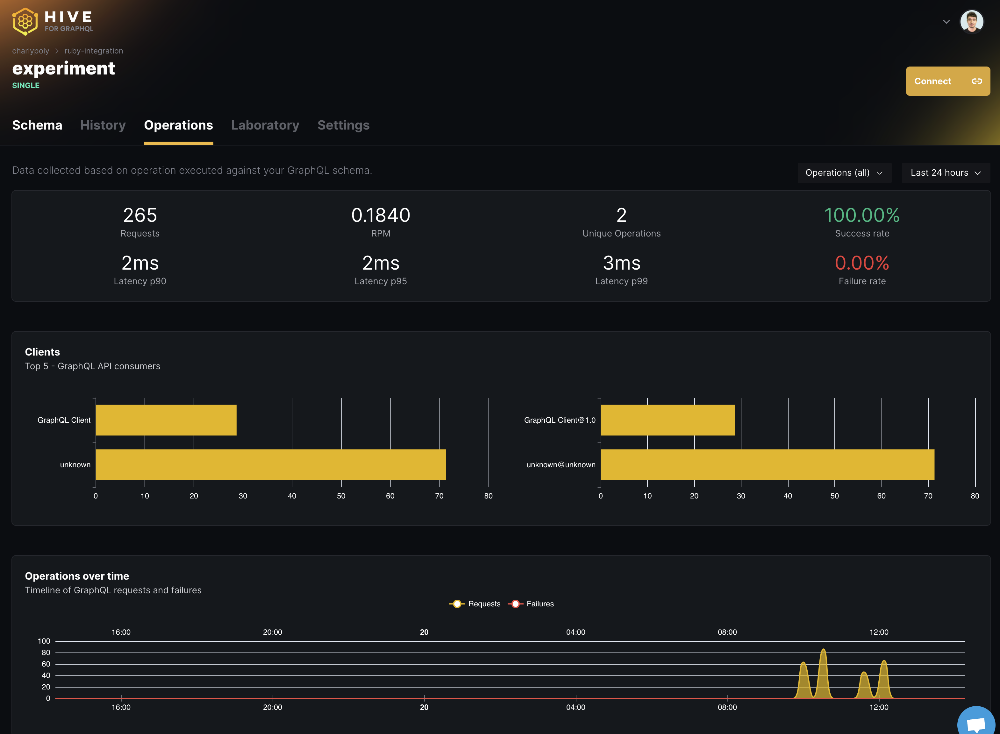

# GraphQL Hive: `graphql-ruby` integration

[](https://github.com/charlypoly/graphql-ruby-hive/actions)
[](https://rubygems.org/gems/graphql-hive)

<p align="center">
  
</p>

[GraphQL Hive](https://graphql-hive.com/) provides all the tools to get
visibility of your GraphQL architecture at all stages, from standalone APIs to
composed schemas (Federation, Stitching):

- **Schema Registry** with custom breaking changes detection
- **Monitoring** of RPM, latency, error rate, and more
- **Integrations** with your favorite tools (Slack, Github Actions, and more)

---

## Getting started

### Get your Hive token

Please refer to the Hive documentation: <https://docs.graphql-hive.com/features/tokens>.

### Install the `grahql-hive` gem

```sh
gem install graphql-hive
```

**2. Configure `GraphQL::Hive` in your Schema**

Add `GraphQL::Hive` **at the end** of your schema definition:

```ruby
class Schema < GraphQL::Schema
  query QueryType

  use(GraphQL::Hive, { token: '<YOUR_TOKEN>' })
end
```

The `reporting` configuration is required to push your GraphQL Schema to the Hive registry.
Doing so will help better detect breaking changes and more upcoming features.
If you only want to use the operations monitoring, replace the `reporting` option with the following `report_schema: false`.

### (Optional) Configure Life-cycle Hooks

Calling these hooks are situational - it's likely that you may not need to call
them at all!

`on_start`

Call this hook if you are running `GraphQL::Hive` in a process that `fork`s
itself.

Example: `puma` web server running in (["clustered
mode"](https://github.com/puma/puma/tree/6d8b728b42a61bcf3c1e4c698c9165a45e6071e8#clustered-mode))

```ruby
# config/puma.rb
preload_app!

on_worker_boot do
  GraphQL::Hive.instance.on_start
end
```

`on_exit`

If your GraphQL API process is shut down non-gracefully but has a shutdown hook
to call into, call `on_worker_exit`.

`puma` example:

```ruby
# config/puma.rb

on_worker_shutdown do
  GraphQL::Hive.instance.on_exit
end
```

You are all set! 🚀

Then deploying or starting up your GraphQL API, `graphql-hive` will immediately:

- publish the schema to the Hive registry
- forward the operations metrics to Hive

### See how your GraphQL API is operating

You should now see operations information (RPM, error rate, queries performed) on your [GraphQL Hive dashboard](https://app.graphql-hive.com/):

<p align="center">
  
</p>

### Going further: use the Hive GitHub app

Stay on top of your GraphQL Schema changes by installing the Hive GitHub Application and enabling Slack notifications about breaking changes:

<https://docs.graphql-hive.com/features/integrations#github>

---

## Configuration

| Key                                  | Description                                      | Default                                               | Example                                                             |
| ------------------------------------ | ------------------------------------------------ | ----------------------------------------------------- | ------------------------------------------------------------------- |
| token                                | Mandatory token for authentication               |                                                       |                                                                     |
| enabled                              | Enable/disable Hive Client                       | `true`                                                |                                                                     |
| debug                                | Enable verbose logs                              | `false`                                               |                                                                     |
| logger                               | Custom logger instance                           |                                                       |                                                                     |
| endpoint                             | Endpoint URL for Hive                            | app.graphql-hive.com                                  |                                                                     |
| port                                 | Port number for Hive                             | 443                                                   |                                                                     |
| buffer_size                          | Number of requests before forwarding to Hive     | 50                                                    |                                                                     |
| collect_usage                        | [DEPRECATED] Report usage to Hive                | `false`                                               | Use `collect_usage_sampling` instead                                |
| collect_usage_sampling.sample_rate   | Percentage of operations to report to Hive       | `1` will track 100% of throughput                     | `0.5` will track 50% of the throughput                              |
| collect_usage_sampling.sampler       | Custom sampling rates logic                      |                                                       | `proc { \|c\| c.operation_name.includes?('someQuery') ? 1 : 0.5 }`  |
| collect_usage_sampling.at_least_once | Sample every distinct operation at least once    | `nil` Will not sample unique operations at least once | `true` will sample unique operations at least once                  |
| collect_usage_sampling.key_generator | Custom key generator for distinct operations     | Creates an Md5 Hash of the operation by default       | `proc { \|c\| c.operation_name }`                                   |
| client_info                          | Proc to identify the client performing the query |                                                       | `proc { \|c\| { name: c.client_name, version: c.client_version } }` |
| report_schema                        | Publish schema to Hive                           | true                                                  |                                                                     |
| reporting.author                     | Author of the latest change                      | Author of the latest change                           |                                                                     |
| reporting.commit                     | Git SHA or any identifier                        | git sha or any identifier                             |                                                                     |
| reporting.service_name               | (Optional) Name of the service                   |                                                       |                                                                     |
| reporting.service_url                | (Optional) URL of the service                    |                                                       |                                                                     |

> [!IMPORTANT]
> A note on `buffer_size` and performance overhead. A large buffer will increase
> memory consumption of your application. A smaller buffer will result in more
> frequent requests to Hive. Usage reporting is handled in a background thread
> to avoid impacting the performance of your GraphQL API.

## Contributing

We welcome contributions to this project and are grateful for your interest in
improving it. To ensure a smooth process, please follow these guidelines:

### Getting Started

1. **Fork the Repository**: Click the "Fork" button at the top right of this
   repository to create a copy of the repository under your GitHub account.

2. **Clone the Forked Repository**:

```sh
git clone https://github.com/your-username/your-repo-name.git
cd your-repo-name
```

3. **Install Dependencies**:
   Ensure you have [Bundler](https://bundler.io/) installed, then run:

```sh
bundle install
```

4. **Run Tests**:
   Make sure everything is working by running the test suite:

```sh
bundle exec rake test
```

5. **Run Integration Tests**:

In one terminal, start the servers:

```sh
cd k6
./boot-servers.sh
```

In another terminal, run the tests:

```sh
k6 run integration-tests.js
```
